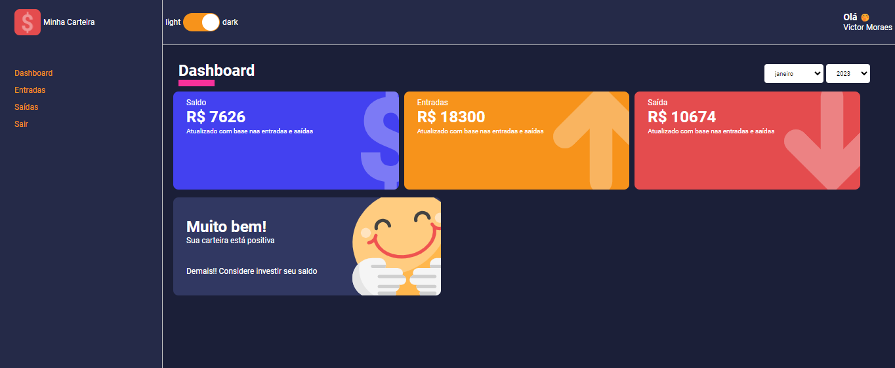

# Monthly Expenses Wallet

A simple monthly expenses wallet application built with React, TypeScript, and Styled-Components.

## Table of Contents

- [Introduction](#introduction)
- [Features](#features)
- [Installation](#installation)
- [Usage](#usage)
- [Technologies Used](#technologies-used)

## Introduction

The Monthly Expenses Wallet is a web application that helps users manage their monthly expenses. The app allows users to filter their expenses based on the selected month and year, making it easier to track and analyze their spending patterns.

## Features

- Filter expenses by month and year
- Visual representation of expenses with bar charts
- Responsive and user-friendly interface

## Installation

1. Clone the repository:

- git clone https://github.com/moraesvictor/my-wallet.git

2. Navigate to the project directory:

- cd my-wallet

3. Install the dependencies:

- npm install

## Usage

1. Run the development server:

- npm start

2. Open your web browser and visit `http://localhost:3000` to access the application.

## Technologies Used

- React
- TypeScript
- Styled-Components

## Contributing

Contributions are welcome! If you find any issues or have suggestions for improvement, please feel free to create a pull request or submit an issue in the repository.
